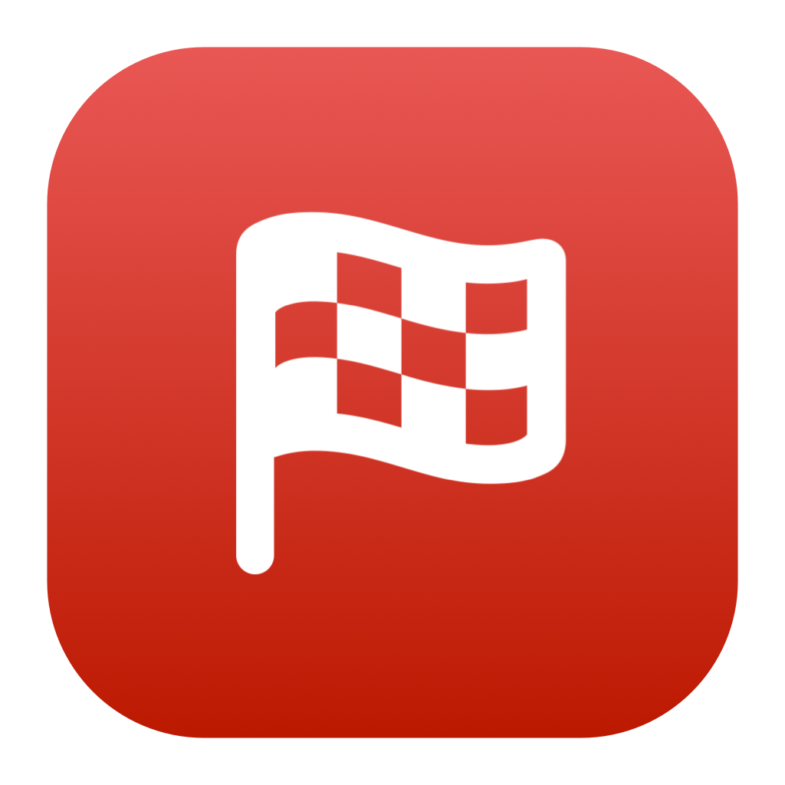
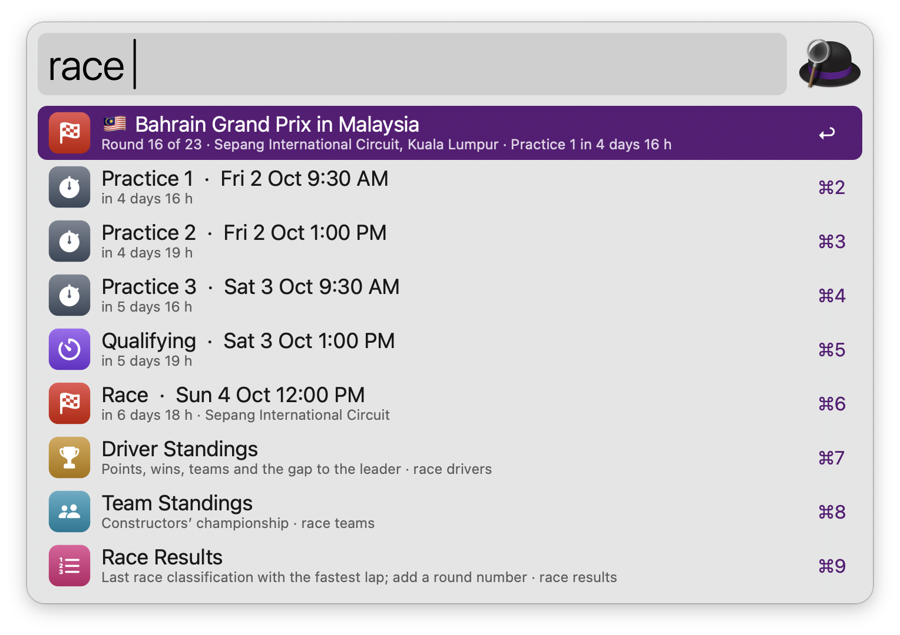
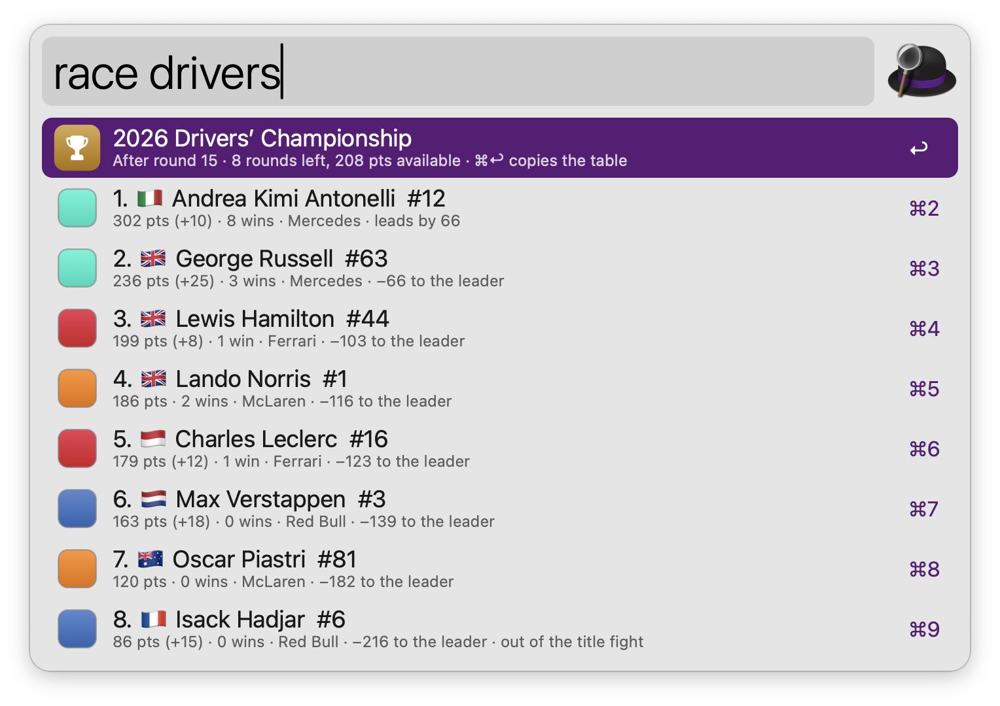
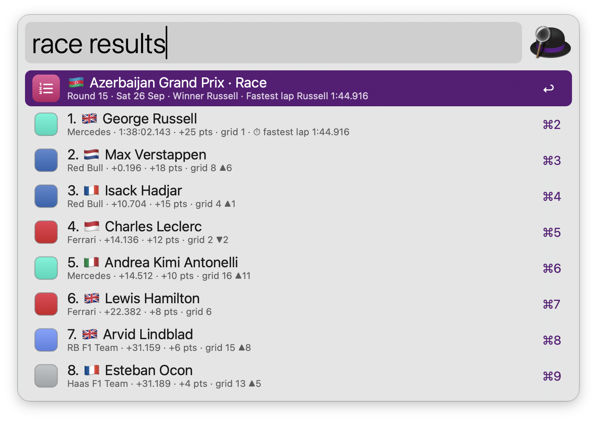
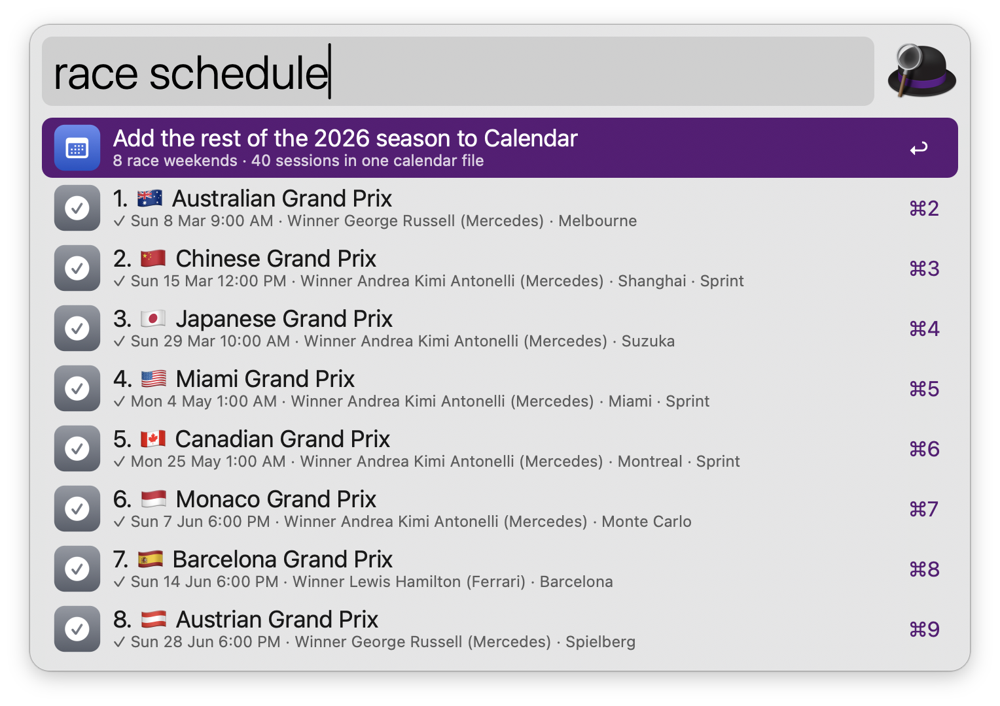
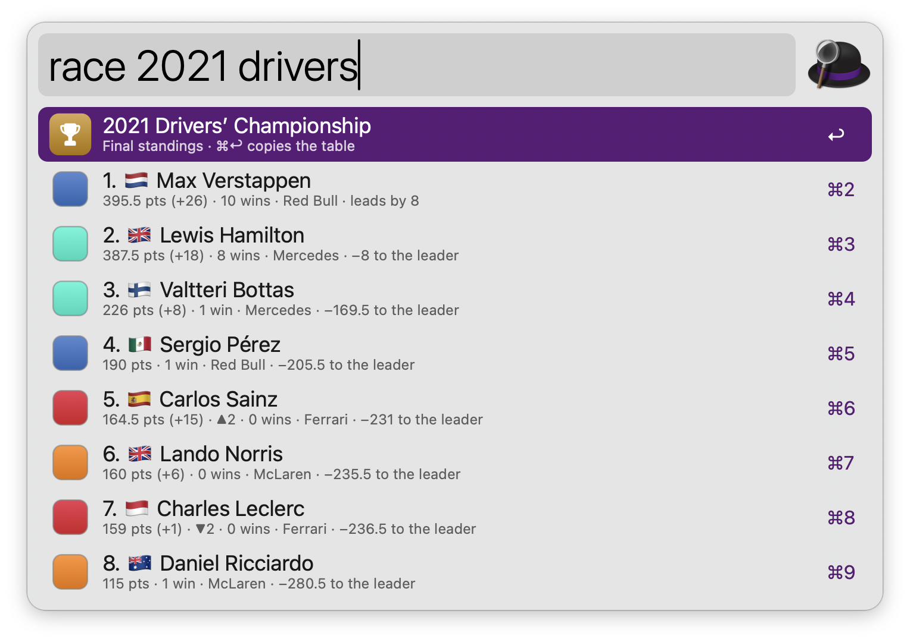

#  Formula 1

The next Formula 1 race weekend in your local time, driver and team standings, results and the season schedule. No dependencies: data comes from the free [Jolpica F1 API](https://github.com/jolpica/jolpica-f1) (the successor to Ergast) and is cached.

## Usage

See the next race weekend via the `race` keyword: every session (practice, sprint qualifying, sprint, qualifying and the race) in local time with a countdown. Sessions that are live or finished are marked, and times not yet confirmed show as TBC.



* <kbd>↩</kbd> Open the race page on formula1.com (or Wikipedia, set in the Workflow’s Configuration).
* <kbd>⌘</kbd><kbd>↩</kbd> Add the session to Calendar. On the race name, add the whole weekend.
* <kbd>⌥</kbd><kbd>↩</kbd> Open the other race page.
* <kbd>⌘</kbd><kbd>Y</kbd> Quick Look the race page.
* <kbd>⌘</kbd><kbd>C</kbd> Copy the session and its time.

Configure the Hotkey to see the next race weekend at a glance.

### Standings

See the drivers’ championship via `race drivers` and the constructors’ championship via `race teams`, with points, wins, the gap to the leader, nationality flags and team colours. Drivers who changed teams during the season show both. Type a name, team or nationality after the command to filter, like `race drivers ferrari`.



* <kbd>↩</kbd> Open the driver’s or team’s Wikipedia page.
* <kbd>⌘</kbd><kbd>↩</kbd> Copy the standings table.

### Results

See the last race’s classification via `race results`, with the winner, fastest lap, points and places gained from the grid. Use `race quali` for qualifying with Q1, Q2 and Q3 times, and `race sprint` for the last sprint. Add a round number or a race name to pick another weekend, like `race results 12` or `race quali monaco`. Press <kbd>⇥</kbd> on the rows at the bottom to switch session or round.



* <kbd>↩</kbd> Open the driver’s Wikipedia page.
* <kbd>⌘</kbd><kbd>↩</kbd> Copy the classification.

### Schedule

See every round of the season via `race schedule`, with the winners of past races and the countdown to the next one. Type a race, city or country to filter. Press <kbd>⇥</kbd> on a past race to see its results.



* <kbd>↩</kbd> Open the race page.
* <kbd>⌘</kbd><kbd>↩</kbd> Add every session of the weekend to Calendar.
* <kbd>⌥</kbd><kbd>↩</kbd> Open the other race page.

### Past Seasons

Start with a year to look back, like `race 2021`, `race 2021 drivers` or `race 2008 results 18`. Seasons go back to 1950.



Standings refresh every hour, the schedule every day, and results every 10 minutes during a race weekend. Without a connection, the last data is shown with a notice.

The keyword, race page, time and date format, and Calendar alert can be changed in the Workflow’s Configuration.

## Development

```bash
swift tools/make_icons.swift tools/icons.json src       # regenerate icons
swift tools/make_swatches.swift tools/teams.json src    # regenerate team colour swatches
python3 tools/build.py --package                         # write src/info.plist and dist/*.alfredworkflow
python3 tests/test_f1.py                                 # run the tests (a mock API serves tests/fixtures)
```

## AI disclosure

This workflow was developed with the help of Claude (Anthropic), an AI assistant. The code is reviewed and tested by the author.
